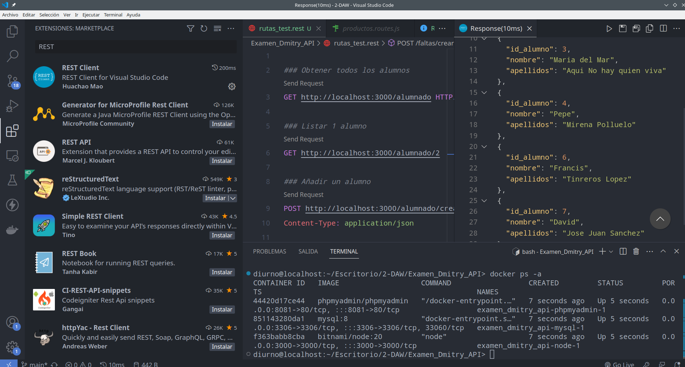
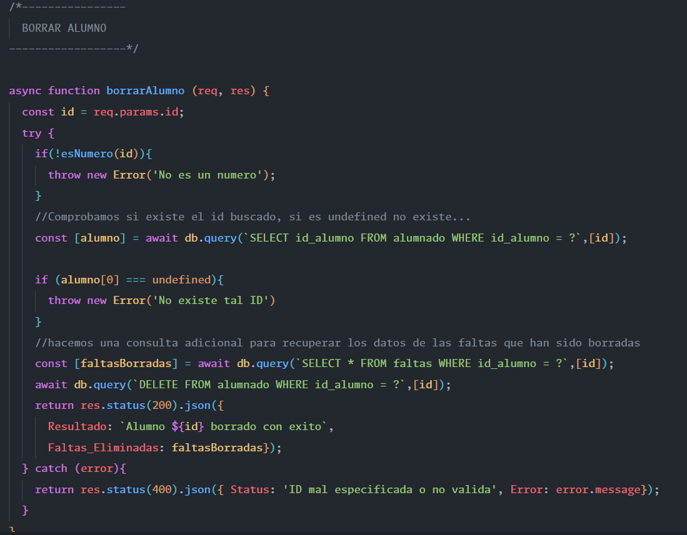
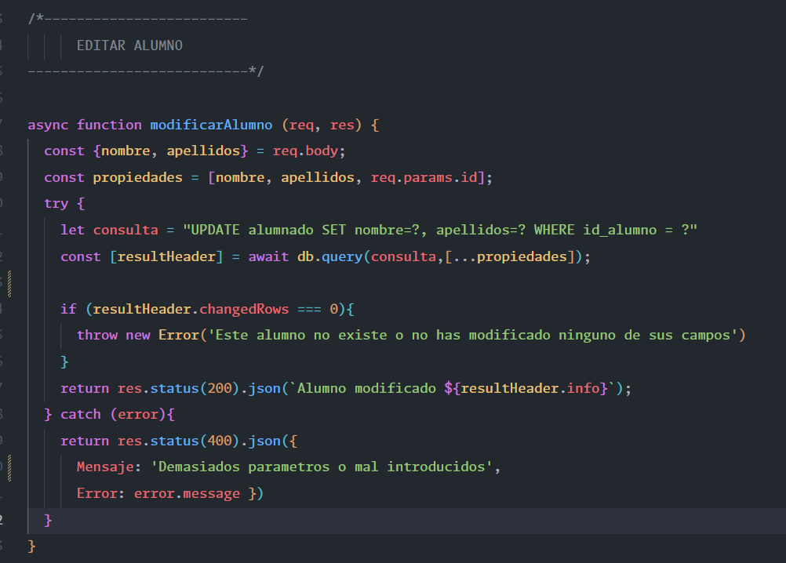

# Examen práctico de una API.

Examen práctico de una API en la asignatura de Entornos de Servidor. Realizada con Node.js y Express. Sin vistas.

## Configuración.

Todas las rutas se encuentran en el archivo ``rutas_test.rest``. Se puede usar la extension VScode ``__REST__`` para comprobar las rutas directamente desde el archivo.

El archivo funciona con el docker-compose donde carga la base de datos automaticamente. El script SQL se encuentra en la carpeta __dump__.

Para abrir el proyecto hace falta usar:
* ``docker-compose up -d``: para lanzar el proyecto.
* ``docker-compose down -v``: para reiniciar la base de datos (-v elimina los volumenes que crea docker).
* ``NPM INSTALL``:  dentro de la carpeta __miApi__ para instalar las dependencias.

## Comprobaciones de rutas.

No he añadido como ejemplo todas las rutas posibles pero la API usa bloques ``try-catch`` para dar siempre una respuesta de __'fallo'__ o __'ok'__.

## Detalles de la implementación.

* He añadido la librería ``dotenv`` para usar las __variables de entorno__ donde están definidas las credenciales de la base de datos y el PUERTO del servidor.
* La carpeta ``HTTP`` no existe porque he optado por el método __app.listen()__ que ofrece Express para crear un servidor directamente en el archivo __app.js__.
* Dentro de los try-catch los metodos devuelven una respuesta con un ``status``según __corresponda__ 
* Se usa el método ``res.json()`` para convertir todo lo que reciba a ``JSON`` de forma automática. Es decir, así evito tener que especificar las cabeceras y usar métodos como "STRINGFY" para mostrar la respuesta en formato ``JSON``.

### Extension REST

### Ejemplo codigo ruta 1

### Ejemplo codigo ruta 2

